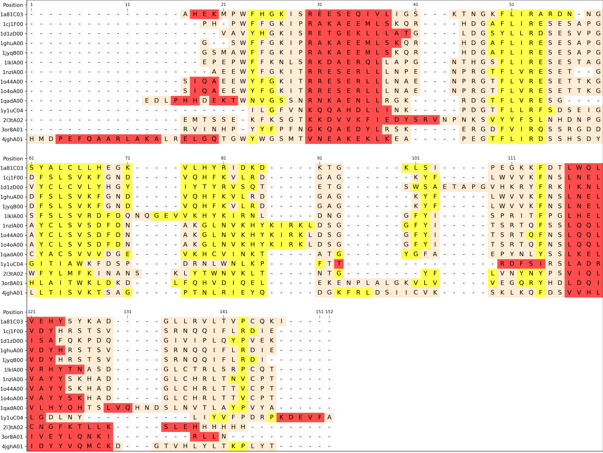

# colorMSAwithSSE
Generate an image from a multiple sequence alignment (MSA) colored by the secondary structures elements (SSE)

## Usage
**Please note that you need a strick match between the sequences in the fasta faile AND your structrures files**. It will not work if there is a mismatch.

1. You will need a fasta where the header countain the PDB filename
2. And all the structures used

## Example
You can run an example within the test folder.
  
`python ../colorMSAwithSSE/colorMSAwithSSE.py -f SH2.fasta -s structures/ -o SH2.png -w 60`

**Output example**
 


## help

```
USAGE: python colorMSAwithSSE.py -f file.fasta -t structuresfolder -o alignment.png

This program is made to generate a picture (SVG/PNG/PDF) of a multiple
sequence alignement with secondary structure element coloration

optional arguments:
  -h, --help            show this help message and exit
  -f FILE, --file FILE  alignment file (FASTA only for now)
  -s STRUCTURES, --structures STRUCTURES
                        structures FOLDER
  -w LINEWIDTH, --linewidth LINEWIDTH
                        line width. Default = 50, choose 0 if you want the
                        picture one 1 line
  -i INTERSPACE, --interspace INTERSPACE
                        interspace between two lines
  -o OUTPUT, --output OUTPUT
                        output file
  -sort SORT, --sort SORT
                        Sort indexes (Y/N) (A->Z)
  -p TICKPOSITION, --tickPosition TICKPOSITION
                        Put the position in the alignment every {tickPosition}

```
## Dependancies:
- Biopython
- Matplotlib
- DSSP
- argparse

You can the dependancies with `conda install -c conda-forge -c salilab dssp biopython`


## Support
Please ask your question/feedback through Github :-)
